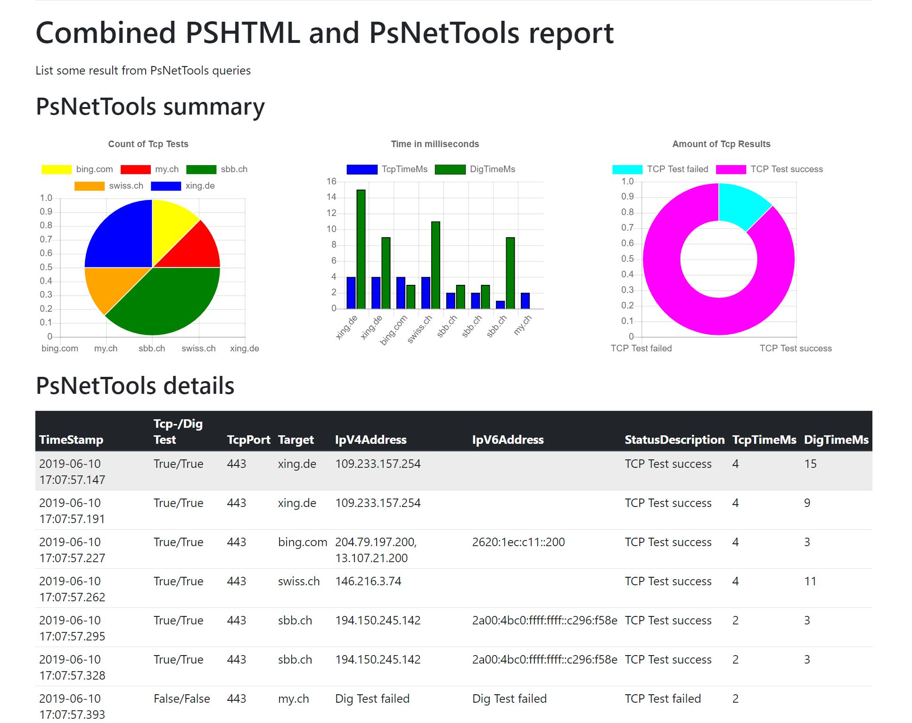

# PSHTMLreports



## Use case

I want to test the behaivor of the TCP Connectivity to multiple endpoint and create a HTML report.

### DataSet

To get the dataset I use my [PsNetTools](https://github.com/tinuwalther/PsNetTools) with the Commandlets Test-PsNetTping and Test-PsNetDig.

````powershell
$tcptest = Test-PsNetTping -Destination $Destination -CommonTcpPort HTTPS -MaxTimeout 1000 -MinTimeout 10
$array = foreach($tping in $tcptest){
    $nslookup = Test-PsNetDig -Destination $tping.Destination
    [PSCustomObject]@{

        TcpSucceeded         = $tping.TcpSucceeded
        TcpPort              = $tping.TcpPort
        TcpTimeStamp         = $tping.TimeStamp
        TcpDestination       = $tping.Destination
        TcpStatusDescription = $tping.StatusDescription
        TcpTimeMs            = $tping.TimeMs

        DigSucceeded         = $nslookup.Succeeded
        DigInputString       = $nslookup.InputString
        DigDestination       = $nslookup.Destination
        DigIpV4Address       = $nslookup.IpV4Address
        DigIpV6Address       = $nslookup.IpV6Address
        DigTimeMs            = $nslookup.TimeMs

    }
}
````
